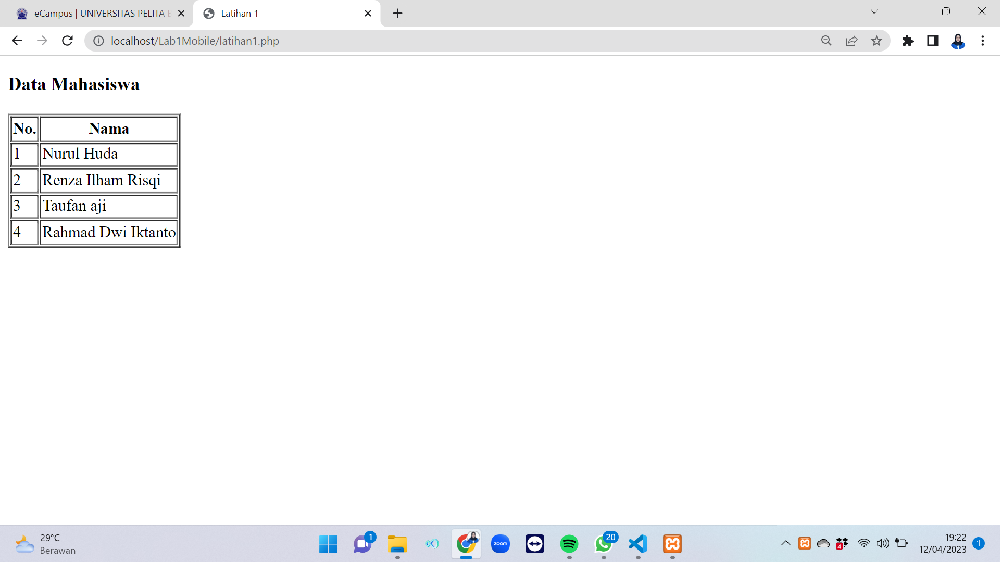
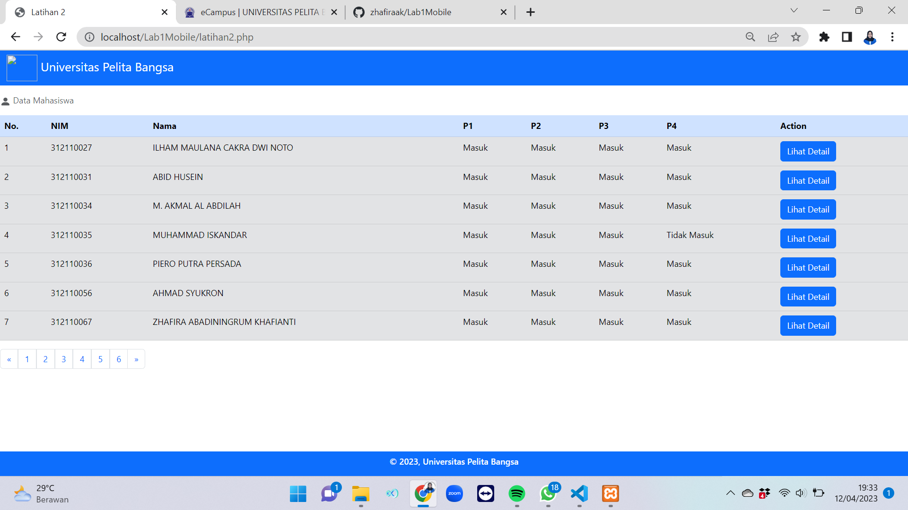

# Lab1Mobile

## Profil
| #               | Biodata              |
| --------------- | -------------------- |
| **Nama**        | Zhafira Abadiningrum |
| **NIM**         | 312110067            |
| **Kelas**       | TI.21.A.1            |
| **Mata Kuliah** | Pemrograman Mobile 2 |

## Latihan 1

### Penjelasan

Program di atas dibangun menggunakan bahasa PHP yang digunakan untuk mengambil data dari URL (https://tifupb.id/data) dalam bentuk JSON dan menampilkannya dalam bentuk tabel di dalam halaman HTML. Berikut ini penjelasan secara detail dari kode tersebut:

1. Baris pertama "<?php" merupakan tag pembuka untuk mengawali kode PHP.
2. Baris kedua mendefinisikan variabel "$url" dengan nilai (https://tifupb.id/data). Variabel ini akan digunakan untuk menyimpan alamat URL dari data yang akan diambil.
3. Baris ketiga menggunakan fungsi "file_get_contents()" untuk mengambil isi dari URL yang tersimpan pada variabel "$url" dan kemudian disimpan dalam variabel "$data".
4. Baris keempat menggunakan fungsi "json_decode()" untuk mengubah format data dari JSON ke dalam bentuk array PHP. Hasilnya kemudian disimpan dalam variabel "$mahasiswa".
5. Baris ke-6 hingga baris ke-16 adalah kode HTML yang akan menampilkan data dalam bentuk tabel.
6. Baris ke-10 hingga baris ke-14 adalah bagian dari kode HTML yang akan menampilkan header tabel dengan dua kolom yaitu "No." dan "Nama".
7. Baris ke-15 mendefinisikan variabel "$no" dengan nilai 1 yang akan digunakan untuk menampilkan nomor urut pada setiap data mahasiswa.
8. Baris ke-16 hingga baris ke-23 menggunakan perulangan foreach untuk menampilkan data mahasiswa dalam bentuk tabel. Setiap item data mahasiswa diambil dari variabel "$mahasiswa" dan diakses dengan indeks "Nama". Kemudian data tersebut akan ditampilkan dalam satu baris tabel dengan nomor urut yang di increment setiap kali menampilkan data mahasiswa baru.
9. Baris ke-24 menutup perulangan foreach.
10. Baris terakhir "</html>" menandakan akhir dari dokumen HTML.
11. Baris terakhir "?>" merupakan tag penutup untuk mengakhiri kode PHP.

## Latihan 2

### Penjelasan

Program latihan 2 diatas adalah sebuah skrip PHP yang sudah dipercantik menggunakan CSS dan digunakan untuk menampilkan data mahasiswa beserta detail absensi dari URL (https://tifupb.id/tugas1). Berikut penjelasan untuk setiap bagian dari kode tersebut:

1. Pertama, variabel "$url" diinisialisasi dengan URL tempat data absensi disimpan.
2. Kemudian, fungsi "file_get_contents()" digunakan untuk membaca seluruh konten dari URL tersebut. Hasilnya disimpan dalam variabel "$data".
3. Selanjutnya, fungsi "json_decode()" digunakan untuk mengubah data dalam format JSON menjadi array PHP yang dapat lebih mudah ditampilkan. Hasilnya disimpan dalam variabel "$absensi".
4. Variabel "$total_absensi" di inisialisasi dengan panjang array "$absensi".
5. Variabel "$data_per_halaman" diinisialisasi dengan jumlah data yang akan ditampilkan per halaman.
6. Variabel "$total_halaman" diinisialisasi dengan jumlah halaman yang dibutuhkan untuk menampilkan seluruh data. Hal ini dihitung dengan menggunakan fungsi "ceil()" untuk membulatkan hasil dari "$total_absensi" / "$data_per_halaman".
7. Variabel "$page" diinisialisasi dengan angka halaman yang diminta pengguna. Jika halaman tidak ditentukan, maka $page diisi dengan angka 1.
8. Variabel "$start_index" diinisialisasi dengan indeks data pertama yang akan ditampilkan pada halaman tersebut.
9. Variabel "$end_index" diinisialisasi dengan indeks data terakhir yang akan ditampilkan pada halaman tersebut.
10. Selanjutnya, skrip PHP beralih ke bagian HTML, di mana sebuah tabel digunakan untuk menampilkan data mahasiswa beserta detail absensi mereka.
11. Bagian awal tabel terdiri dari caption yang memberikan informasi tentang jenis data yang ditampilkan (yaitu data mahasiswa).
12. Baris header tabel (thead) terdiri dari kolom-kolom yang akan menampilkan informasi tentang NIM, nama, dan status kehadiran pada setiap sesi perkuliahan.
13. Baris isi tabel (tbody) akan menampilkan data mahasiswa yang diambil dari variabel "$absensi". Untuk menampilkan data pada setiap kolom, dilakukan iterasi dari "$start_index" sampai "$end_index". Jika indeks data yang ingin ditampilkan melebihi jumlah data absensi yang tersedia, maka iterasi dihentikan.
14. Pada bagian "Action" kolom, terdapat tombol "Lihat Detail" yang akan menampilkan detail absensi mahasiswa tertentu ketika diklik.
15. Setelah selesai menampilkan data pada tabel, dilakukan penambahan navigasi halaman yang terdiri dari beberapa halaman. Setiap halaman direpresentasikan oleh sebuah angka dan link ke halaman tersebut.
16. Tombol navigasi terdiri dari tombol untuk menuju halaman pertama, tombol untuk menuju halaman sebelumnya, tombol untuk menuju halaman berikutnya, dan tombol untuk menuju halaman terakhir. Tombol navigasi tersebut akan di-generate secara dinamis dengan menggunakan iterasi for.

Demikian penjelasan singkat mengenai kode yang diberikan.

